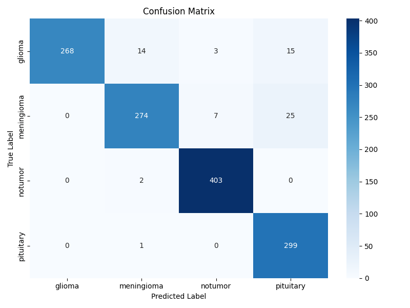

# ViT-Brain: MRI Brain Tumor Classification using Vision Transformers

This repository contains an implementation of a Vision Transformer (ViT) model to classify brain tumors using MRI scans. The project is inspired by the paper ["An Image is Worth 16x16 Words"](https://arxiv.org/abs/2010.11929), which introduced the Vision Transformer architecture for image classification tasks.  

The model is trained to classify MRI brain tumor images into four categories: No Tumor, Glioma Tumor, Meningioma Tumor, and Pituitary Tumor. The dataset used for training and evaluation is the [Brain Tumor MRI Dataset](https://www.kaggle.com/datasets/masoudnickparvar/brain-tumor-mri-dataset) from Kaggle.

## Table of Contents
- [Folder Structure](#folder-structure)
- [Technologies](#technologies)
- [Installation](#installation)
- [Results](#results)

## Folder Structure
```
├── data            # Data directory
│   ├── Testing 
│   └── Training
├── notebooks       # Jupyter notebooks for data exploration and visualization
│   └── eda.ipynb
├── transformer     # Vision Transformer model implementation
│   ├── model
│       └── model.pth
│   ├── section1.py
│   ├── section2.py
│   ├── section3.py
│   └── section4.py
├── utils           # Utility functions for data loading, metrics, and visualization
|   ├── images
│   ├── data_loader.py
│   ├── metrics.py
│   └── visualizations.py
├── .gitignore
├── LICENSE
├── main.py         # Main script to train/test the model
└── README.md
```

## Technologies
- Python 3.8+
- PyTorch
- scikit-learn
- Matplotlib
- Seaborn
- NumPy
- pandas
- Jupyter Notebook

## Installation
1. Clone the repository:
   ```bash
   git clone https://github.com/asherk7/vit-brain.git
   cd vit-brain
    ```
2. Download the dataset from Kaggle and place it in the `data` directory. The directory structure should look like this:
   ```
   ├── data
   │   ├── Testing
   │   └── Training
   ```
3. Run the file `main.py` to train the model (Download the required packages if not already installed):
   ```bash
   python main.py
   ```

## Results

Accuracy and Loss history:


Training Epoch history:


Confusion Matrix:


Classification Report:


Final Model Performance:
```
Accuracy: __%
Precision: __%
Recall: __%
F1 Score: __%
```
The model achieved an accuracy of __% on the test set, demonstrating its effectiveness in classifying brain tumors from MRI scans.