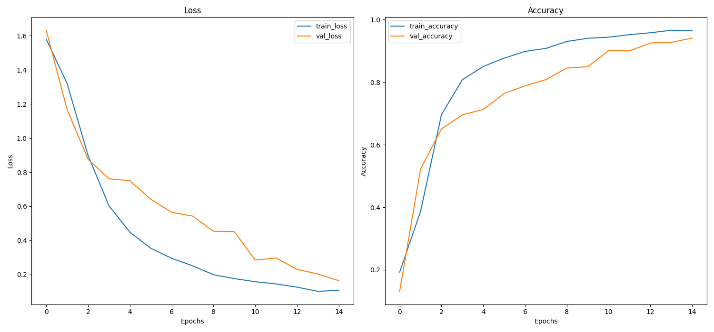
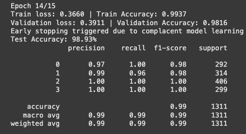

# NeuroViT: Vision Transformer-based brain tumor diagnosis and medical Q&A using RAG-enhanced LLMs.

A full-stack AI-powered application that enables users to upload brain MRI scans, detect tumors with Transformers, and interact with a chatbot enhanced by a retrieval-augmented generation (RAG) system.

## Table of Contents
- [Overview](#overview)
- [How It Works](#how-it-works)
- [Folder Structure](#folder-structure)
- [Key Tools and Technologies](#key-tools-and-technologies)
- [Results](#results)
- [Installation and Usage](#installation-and-usage)
- [References](#references)

## Overview

This repository contains an implementation of a Vision Transformer (ViT) model from scratch to classify brain tumors using MRI scans. The project is inspired by the paper ["An Image is Worth 16x16 Words"](https://arxiv.org/abs/2010.11929), which introduced the Vision Transformer architecture for image classification tasks. The model is trained to classify MRI brain tumor images into four categories: No Tumor, Glioma Tumor, Meningioma Tumor, and Pituitary Tumor. The dataset used for training and evaluation is the [Brain Tumor MRI Dataset](https://www.kaggle.com/datasets/masoudnickparvar/brain-tumor-mri-dataset) from Kaggle.

The model is implemented into the web application, where users can upload images of tumors to have them classified. Once a tumor is detected, the system uses Grad-CAM, from the paper [“Grad-CAM: Visual Explanations from Deep Networks via Gradient-based Localization”](https://arxiv.org/pdf/1610.02391) to generate a heatmap highlighting the tumor region by leveraging the model’s encoder layers. Users can then chat with an AI assistant, powered by Gemma 2B IT, served via vLLM, and enhanced using RAG from Langchain. The information is retrieved from a Vector DB from FAISS, using real scientific literature from PubMed, enabling it to provide accurate and informative medical responses.

Demo: https://youtu.be/dnygzSd4YaE (Originally hosted at http://99.79.114.128/, now permanently offline)

## How It Works

1. **MRI Upload & Tumor Detection**: Users upload brain MRI scans via the web interface. A Vision Transformer model classifies the presence and type of tumor and generates a Grad-CAM heatmap to visually highlight tumor regions in the scan. 
2. **Medical Report Generation**: Once a tumor is detected, the system generates a concise medical report summarizing the findings. This report is supported by relevant scientific literature retrieved through an RAG pipeline, ensuring the information is evidence-based and up-to-date.
3. **AI Doctor Chatbot**: Users can interact with an AI-powered medical chatbot to ask detailed questions about their diagnosis, treatment options, prognosis, and more. The chatbot leverages a large language model (LLM) integrated with the RAG system and a vector database of scientific papers on brain tumors, enabling it to provide accurate, context-aware, and medically informed responses.
4. **Data Handling and Storage**: Uploaded images and chat interactions are processed transiently for inference and are not stored persistently, ensuring user privacy.

Pipeline:
```
[User Upload] -> [ViT Tumor Classifier] -> [Grad-CAM Heatmap] 
      ↓                                            ↓
[LLM Chatbot (RAG)]                        [Report Generator]
```

## Folder Structure

```
├── api/                     # FastAPI backend and endpoints
│   ├── core                    # Core logic and service modules
│   ├── routes                  # API route handlers
│   ├── static                  # Static files (CSS, JS, images)
│   ├── templates               # App UI templates
│   └── ...                     # Supporting files
├── data/                    # MRI dataset
├── docker/                  # Docker and deployment setup
├── llm/                     # vLLM deployment & LangChain integration
├── rag/                     # Vector database & RAG setup
│   ├── papers                  # PubMed papers and embeddings
│   ├── vectorstore             # Vector database for RAG
│   └── ...                     # Supporting files
├── scraper/                 # PubMed scraping script
├── vit/                     # Vision Transformer implementation
│   ├── eda                     # Exploratory data analysis
│   ├── model                   # Trained weights
│   ├── pipeline                # Training/evaluation pipelines
│   ├── transformer             # Transformer architecture
│   └── ...                     # Supporting files
├── .env                     # Environment variables for AWS
├── .gitignore 
├── LICENSE 
├── requirements.txt         # Package and Library versions
└── README.md
```

## Key Tools and Technologies

### Model

- **PyTorch**: Implementing and training the ViT model from scratch.
- **Scikit-learn**: Preprocessing and evaluation metrics.
- **Matplotlib/Seaborn**: Visualizing images and training performance.
- **NumPy**: Image tensor manipulation and numerical operations.
- **Pandas**: Dataset manipulation.
- **ONNX**: Model conversion and deployment.

The Vision Transformer model is implemented from scratch, following the ViT-Base architecture introduced in ["An Image is Worth 16x16 Words"](https://arxiv.org/abs/2010.11929). The model was trained in two phases: an initial training phase using pretrained ImageNet1k ViT weights from PyTorch (ViT_B_16_Weights.IMAGENET1K_V1), followed by fine-tuning to optimize performance and accuracy. The implementation closely follows the original architecture, including its optimizer, loss function, and learning rate scheduler, with slight adjustments tailored to the training environment and the smaller dataset size. All modified hyperparameters are documented in `vit/create_model.py`.

- **Initial Training:** Learning rate = `0.0001`, batch size = `32`, epochs = `25`, beta = `(0.9, 0.999)`, weight decay = `0.01`, label smoothing = `0.1`.
- **Fine-tuning:** Learning rate = `0.00001`, epochs = `15`, attention dropout = `0.05`, weight decay = `0.001`, label smoothing = `0.05`.

Data augmentation includes random rotations, flips, shifts, and normalizing. Early stopping is used to avoid overfitting, and the best model is saved for deployment.

### Application

- **FastAPI:** Backend framework for the user interface and API endpoints.
- **OpenCV:** Image processing and creating heatmaps on MRI scans.
- **LangChain:** Handles the pipeline for RAG in the chatbot.
- **vLLM:** High-performance serving system to deploy local LLMs.
- **OpenAI:** API Interface for communcation with the local LLM server.
- **HuggingFace:** Used HF Transformers and Embeddings to create vector embeddings for publications.
- **FAISS:** Fast vector similarity search to index and retrieve embedded PubMed publications.
- **PubMed:** Gathers up-to-date biomedical papers from PubMed on brain tumors.

The application is structured to provide a seamless end-to-end experience for brain tumor detection and medical assistance. Users upload MRI scans via a FastAPI-powered web interface, then the image is classified by a Vision Transformer model. Once the tumor type is identified, a heatmap is generated using Grad-CAM, from the paper ["Grad-CAM: Visual Explanations from Deep Networks via Gradient-based Localization"](https://arxiv.org/pdf/1610.02391), and OpenCV to visually highlight the region of interest on the scan.

- **RAG Pipeline:** After classification, a diagnostic report is generated summarizing the findings. To support the report with scientific evidence, full-text PubMed papers related to brain tumors are scraped and filtered. These are embedded into vector representations using Hugging Face Embeddings, then stored in a FAISS vector database. LangChain’s RAG pipeline is used to query this vectorstore, returning relevant information for the report.

Users can then talk to an AI medical chatbot, powered by the Gemma 2B IT model served through vLLM using an OpenAI-compatible API wrapper. The chatbot can explain diagnoses, treatment options, and related brain tumors using publications retrieved from the RAG pipeline.

### Deployment

- **Docker** – Containerizes all components for reproducible deployment.
- **Docker Compose** – Manages multi-service containers (FastAPI, vLLM).
- **AWS EC2** – Hosts the deployed application in the cloud.
- **Nginx** – Acts as a reverse proxy to serve the app.
- **Gunicorn** – Runs the FastAPI app as a WSGI server.

The entire stack is containerized using Docker and orchestrated with Docker Compose. It's deployed on AWS EC2, with Nginx handling reverse proxying and Gunicorn running the FastAPI backend.

The application was deployed on an AWS EC2 instance using the g4dn.xlarge GPU configuration to enable accelerated inference with vLLM. The Docker images were converted from the ARM64 architecture to AMD64 to ensure compatibility with the EC2 instance and then pushed to AWS Elastic Container Registry (ECR) for scalable storage. On the EC2 instance, Docker, the NVIDIA container toolkit, the CUDA toolkit, and the appropriate Ubuntu NVIDIA GPU drivers were installed following the process outlined in this [setup guide](https://www.youtube.com/watch?v=N_KFYqvEZvU). The Docker images were pulled from ECR and orchestrated using Docker Compose. This approach enabled the FastAPI backend and vLLM server to run concurrently, leveraging the GPU to maximize performance and reduce inference latency.

## Results

Accuracy and Loss history:


F1 Score:  


Final Model Performance:
```
Train Accuracy: 99.37%
Validation Accuracy: 98.16%
Test Accuracy: 98.93%
```

## Installation and Usage
1. **Clone the Repository:**
   ```bash
   git clone https://github.com/asherk7/NeuroViT.git
   cd NeuroViT
   ```
2. **Train the Model:**
   - Install dependencies then create the model:
   ```bash
   python vit/create_model.py 
   python utils/convert_model.py
   ```
   - This will train the Vision Transformer model on the brain tumor MRI dataset.
3. **Run the Docker Containers:**
   - Ensure Docker and Docker Compose are installed.
   - Build and run the containers:
   ```bash
   cd docker
   docker-compose up --build
   ```
   - Access the application at `http://127.0.0.1:8000`.
   - Use the web interface to upload MRI scans for tumor detection.
   - Interact with the AI chatbot to ask questions about your diagnosis and treatment options.

### Disclaimer  
The model can be trained on CPU or GPU (recommended), however, the vLLM model can only be deployed using a GPU

### Future Improvements  
- Combine AskLLM and WrapperLLM into one class, refactor the code to use this class in the RAG and regular call
- Add guardrails for images and messages sent that aren't medical-related
- Finding the most probable tumour locations using the average heatmap
  - Hook the last encoder layer and grab the CLS token (1, 197, 768)
  - Use UMAP and reduce dimensionality, use K-Means to cluster images (get clusters of different brain scan angles)
  - For each cluster, calculate a heatmap for each image using gradient values and GRAD-CAM equations
  - Normalize and average the heatmaps, get the most probable tumour location for each view
- Fine-tune the LLM on a medical dataset using QLoRA & HF PEFT, then quantize
- Add the Tumour model to HuggingFace for public use

## References
- [An Image is Worth 16x16 Words: Transformers for Image Recognition at Scale](https://arxiv.org/abs/2010.11929)
- [Grad-CAM: Visual Explanations from Deep Networks via Gradient-based Localization](https://arxiv.org/pdf/1610.02391)
- [Kaggle Brain Tumor MRI Dataset](https://www.kaggle.com/datasets/masoudnickparvar/brain-tumor-mri-dataset)
- [PubMed API Documentation](https://www.ncbi.nlm.nih.gov/books/NBK25501/)
- [Setup an AI / ML Server From Scratch in AWS With NVIDIA GPU, Docker](https://www.youtube.com/watch?v=N_KFYqvEZvU)
